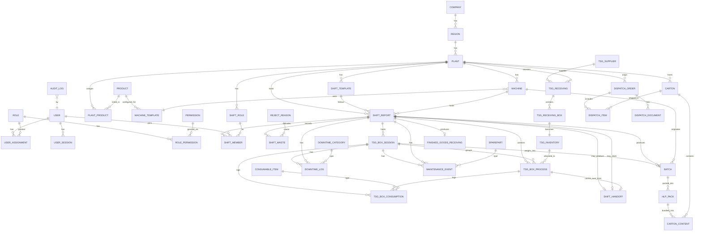

# 04 · Data Model — ERD & Schema Drizzle

Skema data final untuk **Fase 0 (Foundation)** dan **Fase 1 (Pilot)**. Fase 2–4 hanya menambahkan agregasi (materialized view) — tidak mengubah tabel utama.

**ORM**: Drizzle ORM · **DB**: PostgreSQL 16 · **Tenancy**: shared schema + `plantId` + Row-Level Security.

---

## 1. Ringkasan Grup Tabel

| Grup | Tabel | Fase |
|---|---|---|
| **Tenancy** | `company`, `region`, `plant` | 0 |
| **Identity & RBAC** | `user`, `user_session`, `role`, `permission`, `role_permission`, `user_assignment` | 0 |
| **Master Data** | `product`, `plant_product`, `machine`, `machine_template`, `consumable_item`, `sparepart`, `shift_role`, `shift_template`, `downtime_category`, `reject_reason`, `waste_category` (enum), `tsg_supplier` | 0 |
| **WMS Inbound** | `tsg_receiving`, `tsg_receiving_box`, `tsg_inventory` | 1 |
| **Operasional Shift** | `shift_report`, `shift_member`, `shift_waste`, `shift_handoff` | 1 |
| **Operasional Boks & Produksi** | `tsg_box_session` (+ FK batch), `tsg_box_process` (+ FK session & inventory), `tsg_box_consumption` (boks opsional, + FK session), `downtime_log`, `maintenance_event`, `batch`, `hlp_pack` | 1 |
| **WMS Outbound** | `finished_goods_receiving`, `carton`, `carton_content` | 5 |
| **Distribusi** | `dispatch_order`, `dispatch_item`, `dispatch_document` | 6 |
| **Compliance** | `audit_log`, `qr_registry` | 0 (QR skeleton), 1 (audit aktif) |
| **Agregasi** | `mv_area_daily_kpi`, `mv_hq_monthly_rollup` | 2, 4 |

**Total tabel terdefinisi: 48** (per Agustus 2026; materialized view & enum tidak dihitung).

---

## 2. ERD (Mermaid)



---

## 3. Skema Drizzle — Tenancy

```ts
// src/db/schema/tenancy.ts
import { pgTable, uuid, text, timestamp, integer } from 'drizzle-orm/pg-core';

export const company = pgTable('company', {
  id: uuid('id').primaryKey().defaultRandom(),
  code: text('code').notNull().unique(),
  name: text('name').notNull(),
  createdAt: timestamp('created_at').notNull().defaultNow(),
  deletedAt: timestamp('deleted_at'),
});

export const region = pgTable('region', {
  id: uuid('id').primaryKey().defaultRandom(),
  companyId: uuid('company_id').notNull().references(() => company.id),
  code: text('code').notNull(),           // 'AREA-JATIM'
  name: text('name').notNull(),           // 'Area Jawa Timur'
  createdAt: timestamp('created_at').notNull().defaultNow(),
  deletedAt: timestamp('deleted_at'),
}, (t) => ({
  uniqueCodePerCompany: unique().on(t.companyId, t.code),
}));

export const plant = pgTable('plant', {
  id: uuid('id').primaryKey().defaultRandom(),
  regionId: uuid('region_id').notNull().references(() => region.id),
  code: text('code').notNull().unique(),  // 'PLT-MLG-01'
  name: text('name').notNull(),
  timezone: text('timezone').notNull().default('Asia/Jakarta'),
  address: text('address'),
  createdAt: timestamp('created_at').notNull().defaultNow(),
  deletedAt: timestamp('deleted_at'),
});
```

**Aturan**:
- `plant.timezone` sudah disiapkan untuk fase lanjut kalau ada pabrik lintas TZ, tapi default WIB.
- Semua tabel operasional (di grup lain) wajib punya `plantId` yang mengarah ke tabel ini.

---

## 4. Skema Drizzle — Identity & RBAC

```ts
// src/db/schema/identity.ts
export const user = pgTable('user', {
  id: uuid('id').primaryKey().defaultRandom(),
  username: text('username').notNull().unique(),
  passwordHash: text('password_hash').notNull(),  // bcrypt
  fullName: text('full_name').notNull(),
  email: text('email'),
  phone: text('phone'),
  isActive: boolean('is_active').notNull().default(true),
  createdAt: timestamp('created_at').notNull().defaultNow(),
  deletedAt: timestamp('deleted_at'),
});

export const deviceTypeEnum = pgEnum('device_type', ['MOBILE', 'WEB']);

export const userSession = pgTable('user_session', {
  id: uuid('id').primaryKey().defaultRandom(),
  userId: uuid('user_id').notNull().references(() => user.id),
  refreshTokenHash: text('refresh_token_hash').notNull(),  // hash(sha256) refresh token
  activeScopeType: text('active_scope_type').notNull(),    // 'GLOBAL' | 'COMPANY' | 'REGION' | 'PLANT'
  activeScopeId: uuid('active_scope_id'),                  // NULL kalau GLOBAL (SUPERADMIN)
  deviceType: deviceTypeEnum('device_type').notNull(),     // MOBILE | WEB
  deviceId: text('device_id'),                             // stable device identifier (androidId hash / IDFV / UUID)
  deviceName: text('device_name'),                         // 'Samsung SM-A125 · Alfi's phone'
  pushToken: text('push_token'),                           // FCM/APNs token untuk notif
  ipAddress: text('ip_address'),
  userAgent: text('user_agent'),
  lastActiveAt: timestamp('last_active_at').notNull().defaultNow(),
  expiresAt: timestamp('expires_at').notNull(),
  revokedAt: timestamp('revoked_at'),
  revokedBy: uuid('revoked_by').references(() => user.id),   // FK, siapa yang revoke (SUPERADMIN atau user sendiri)
  revokedReason: text('revoked_reason'),
  createdAt: timestamp('created_at').notNull().defaultNow(),
}, (t) => ({
  // Single-session mobile: hanya boleh 1 session aktif per user untuk deviceType MOBILE
  uniqueActiveMobile: unique('uq_session_active_mobile').on(t.userId).where(sql`device_type = 'MOBILE' AND revoked_at IS NULL`),
  idxUserActive: index('idx_session_user_active').on(t.userId).where(sql`revoked_at IS NULL`),
}));

export const role = pgTable('role', {
  id: uuid('id').primaryKey().defaultRandom(),
  code: text('code').notNull().unique(),  // 'SUPERADMIN', 'HQ_ADMIN', 'PLANT_MANAGER', dst
  name: text('name').notNull(),
  description: text('description'),
  scopeLevel: text('scope_level').notNull(),  // 'GLOBAL' | 'COMPANY' | 'REGION' | 'PLANT'
  isPrivileged: boolean('is_privileged').notNull().default(false),  // true untuk SUPERADMIN
  createdAt: timestamp('created_at').notNull().defaultNow(),
});

// Auth policy per role (khususnya untuk SUPERADMIN)
export const authPolicy = pgTable('auth_policy', {
  id: uuid('id').primaryKey().defaultRandom(),
  roleId: uuid('role_id').notNull().references(() => role.id).unique(),
  accessTokenTtlMinutes: integer('access_token_ttl_minutes').notNull().default(15),
  refreshTokenTtlDays: integer('refresh_token_ttl_days').notNull().default(30),
  require2fa: boolean('require_2fa').notNull().default(false),
  ipAllowlist: text('ip_allowlist').array(),  // NULL = allow all
  maxActiveAssignments: integer('max_active_assignments'),  // NULL = unlimited; SUPERADMIN = 3
});
// Untuk SUPERADMIN: TTL 5 menit, refresh 7 hari, require2fa=true, maxActive=3.


export const permission = pgTable('permission', {
  id: uuid('id').primaryKey().defaultRandom(),
  code: text('code').notNull().unique(),  // 'shift.approve', 'masterdata.product.edit'
  description: text('description'),
});

export const rolePermission = pgTable('role_permission', {
  roleId: uuid('role_id').notNull().references(() => role.id),
  permissionId: uuid('permission_id').notNull().references(() => permission.id),
}, (t) => ({
  pk: primaryKey({ columns: [t.roleId, t.permissionId] }),
}));

export const userAssignment = pgTable('user_assignment', {
  id: uuid('id').primaryKey().defaultRandom(),
  userId: uuid('user_id').notNull().references(() => user.id),
  scopeType: text('scope_type').notNull(),  // 'COMPANY' | 'REGION' | 'PLANT'
  scopeId: uuid('scope_id').notNull(),      // FK ke company.id / region.id / plant.id
  roleId: uuid('role_id').notNull().references(() => role.id),
  assignedBy: uuid('assigned_by').notNull().references(() => user.id),
  assignedAt: timestamp('assigned_at').notNull().defaultNow(),
  revokedAt: timestamp('revoked_at'),
}, (t) => ({
  uniqueActive: unique().on(t.userId, t.scopeType, t.scopeId, t.roleId).where(sql`revoked_at IS NULL`),
  idxScope: index('idx_ua_scope').on(t.scopeType, t.scopeId),
}));
```

**Aturan RBAC**:
- Satu user boleh punya banyak `user_assignment` — mis. `Andi = KOORDINATOR @ Jatim + AUDITOR @ Company`.
- `activeScopeType` + `activeScopeId` di `user_session` menentukan **scope mana yang aktif untuk sesi ini**. User bisa switch lewat `POST /auth/switch-scope`.
- Permission dievaluasi: cek `role_permission` untuk role di `user_assignment` yang aktif dan scope-nya cover resource yang diakses.

---

## 5. Skema Drizzle — Master Data

### 5.1. Product & Machine Template

```ts
// src/db/schema/master-product.ts
export const product = pgTable('product', {
  id: uuid('id').primaryKey().defaultRandom(),
  code: text('code').notNull().unique(),   // 'PRD-HMR-STD'
  brand: text('brand').notNull(),          // 'Hummer'
  variant: text('variant'),                // 'STD', 'LTS', dst
  isActive: boolean('is_active').notNull().default(true),
  createdAt: timestamp('created_at').notNull().defaultNow(),
  deletedAt: timestamp('deleted_at'),
});

export const plantProduct = pgTable('plant_product', {
  plantId: uuid('plant_id').notNull().references(() => plant.id),
  productId: uuid('product_id').notNull().references(() => product.id),
  isEnabled: boolean('is_enabled').notNull().default(true),
  createdAt: timestamp('created_at').notNull().defaultNow(),
}, (t) => ({
  pk: primaryKey({ columns: [t.plantId, t.productId] }),
}));

export const machineTypeEnum = pgEnum('machine_type', ['MAKER', 'HLP']);

export const machine = pgTable('machine', {
  id: uuid('id').primaryKey().defaultRandom(),
  plantId: uuid('plant_id').notNull().references(() => plant.id),
  code: text('code').notNull(),            // 'MKR-01', 'HLP-01' — unique per plant
  name: text('name').notNull(),
  type: machineTypeEnum('type').notNull(),
  isActive: boolean('is_active').notNull().default(true),
  createdAt: timestamp('created_at').notNull().defaultNow(),
  deletedAt: timestamp('deleted_at'),
}, (t) => ({
  uniqueCodePerPlant: unique().on(t.plantId, t.code),
  idxPlant: index('idx_machine_plant').on(t.plantId),
}));

export const machineTemplate = pgTable('machine_template', {
  id: uuid('id').primaryKey().defaultRandom(),
  productId: uuid('product_id').notNull().references(() => product.id),
  machineType: machineTypeEnum('machine_type').notNull(),
  yieldMinPct: decimal('yield_min_pct', { precision: 5, scale: 2 }).notNull(),   // 110.00
  yieldMaxPct: decimal('yield_max_pct', { precision: 5, scale: 2 }).notNull(),   // 114.00
  targetBeratPerBatangGram: decimal('target_berat_per_batang_gram', { precision: 5, scale: 3 }),
  isCurrent: boolean('is_current').notNull().default(true),  // versioning
  createdAt: timestamp('created_at').notNull().defaultNow(),
}, (t) => ({
  uniqueCurrentPerProductMachine: unique().on(t.productId, t.machineType).where(sql`is_current = true`),
}));
```

### 5.2. Consumable, Sparepart, dan referensi lain

```ts
export const consumableItem = pgTable('consumable_item', {
  id: uuid('id').primaryKey().defaultRandom(),
  code: text('code').notNull().unique(),    // 'item_BOBBIN_HMR'
  name: text('name').notNull(),             // 'Bobbin Hummer'
  unit: text('unit').notNull().default('roll'),  // 'roll', 'kg', 'unit'
  productId: uuid('product_id').references(() => product.id),  // NULL = universal
  isActive: boolean('is_active').notNull().default(true),
});

export const sparepart = pgTable('sparepart', {
  id: uuid('id').primaryKey().defaultRandom(),
  code: text('code').notNull().unique(),    // 'sp_PISAU_FILTER'
  name: text('name').notNull(),
  unit: text('unit').notNull().default('unit'),
  isActive: boolean('is_active').notNull().default(true),
});

export const shiftRole = pgTable('shift_role', {
  id: uuid('id').primaryKey().defaultRandom(),
  plantId: uuid('plant_id').references(() => plant.id),  // NULL = global untuk semua plant
  code: text('code').notNull(),             // 'ketua_kecer', 'operator', 'pembantu'
  name: text('name').notNull(),
  canApproveShift: boolean('can_approve_shift').notNull().default(false),
  canEndShift: boolean('can_end_shift').notNull().default(false),
  displayOrder: integer('display_order').notNull().default(0),
}, (t) => ({
  uniqueCodePerScope: unique().on(t.plantId, t.code),
}));

export const shiftTemplate = pgTable('shift_template', {
  id: uuid('id').primaryKey().defaultRandom(),
  plantId: uuid('plant_id').notNull().references(() => plant.id),
  code: text('code').notNull(),             // 'shift_pagi', 'shift_malam'
  name: text('name').notNull(),
  startTime: text('start_time').notNull(),  // 'HH:MM' — '05:30'
  durationMinutes: integer('duration_minutes').notNull(),  // 660 = 11h; 780 = 13h
  displayOrder: integer('display_order').notNull().default(0),
  isActive: boolean('is_active').notNull().default(true),
}, (t) => ({
  uniqueCodePerPlant: unique().on(t.plantId, t.code),
}));

export const downtimeCategoryEnum = pgEnum('downtime_category', [
  'GANTI_MATERIAL', 'KENDALA_MESIN', 'TUNGGU_BAHAN', 'ISTIRAHAT_IZIN', 'MAINTENANCE'
]);

export const rejectReason = pgTable('reject_reason', {
  id: uuid('id').primaryKey().defaultRandom(),
  code: text('code').notNull().unique(),    // 'BATANG_PATAH'
  name: text('name').notNull(),
  isActive: boolean('is_active').notNull().default(true),
});

export const wasteCategoryEnum = pgEnum('waste_category', [
  'MENIR', 'RIJEKAN', 'DEBU_KASAR', 'DEBU_HALUS'
]);

export const settlementStatusEnum = pgEnum('settlement_status', ['PENDING', 'LUNAS']);
```

---

## 6. Skema Drizzle — Operasional Shift

### 6.1. ShiftReport & ShiftMember

```ts
// src/db/schema/shift.ts
export const shiftStatusEnum = pgEnum('shift_status', ['RUNNING', 'COMPLETED', 'APPROVED']);

export const shiftReport = pgTable('shift_report', {
  id: uuid('id').primaryKey().defaultRandom(),
  plantId: uuid('plant_id').notNull().references(() => plant.id),  // ← wajib untuk RLS
  machineId: uuid('machine_id').notNull().references(() => machine.id),
  productId: uuid('product_id').notNull().references(() => product.id),
  shiftTemplateId: uuid('shift_template_id').notNull().references(() => shiftTemplate.id),
  reportDate: date('report_date').notNull(),  // tanggal shift mulai (WIB)
  actualStart: timestamp('actual_start').notNull(),
  actualEnd: timestamp('actual_end'),
  status: shiftStatusEnum('status').notNull().default('RUNNING'),
  createdBy: uuid('created_by').notNull().references(() => user.id),
  approvedBy: uuid('approved_by').references(() => user.id),
  approvedAt: timestamp('approved_at'),
  reviewNotes: text('review_notes'),
  notes: text('notes'),
  createdAt: timestamp('created_at').notNull().defaultNow(),
  deletedAt: timestamp('deleted_at'),
}, (t) => ({
  idxPlantDate: index('idx_shift_plant_date').on(t.plantId, t.reportDate),
  idxMachineRunning: index('idx_shift_machine_running').on(t.machineId).where(sql`status = 'RUNNING'`),
}));

export const shiftMember = pgTable('shift_member', {
  id: uuid('id').primaryKey().defaultRandom(),
  shiftReportId: uuid('shift_report_id').notNull().references(() => shiftReport.id, { onDelete: 'cascade' }),
  userId: uuid('user_id').notNull().references(() => user.id),
  shiftRoleId: uuid('shift_role_id').notNull().references(() => shiftRole.id),
  leaveMinutes: integer('leave_minutes').notNull().default(0),  // izin dalam menit
  note: text('note'),                       // 'Izin pengajian 18:30-19:30'
  createdAt: timestamp('created_at').notNull().defaultNow(),
}, (t) => ({
  uniqueUserPerShift: unique().on(t.shiftReportId, t.userId),
}));

export const shiftWaste = pgTable('shift_waste', {
  id: uuid('id').primaryKey().defaultRandom(),
  shiftReportId: uuid('shift_report_id').notNull().references(() => shiftReport.id, { onDelete: 'cascade' }),
  category: wasteCategoryEnum('category').notNull(),
  kg: decimal('kg', { precision: 10, scale: 2 }).notNull(),
  settlementStatus: settlementStatusEnum('settlement_status').notNull().default('PENDING'),
  settledAt: timestamp('settled_at'),
  settledBy: uuid('settled_by').references(() => user.id),
  note: text('note'),
}, (t) => ({
  uniqueCategoryPerShift: unique().on(t.shiftReportId, t.category),
}));
```

### 6.2. ShiftHandoff

```ts
export const shiftHandoff = pgTable('shift_handoff', {
  id: uuid('id').primaryKey().defaultRandom(),
  fromShiftId: uuid('from_shift_id').notNull().references(() => shiftReport.id),
  machineId: uuid('machine_id').notNull().references(() => machine.id),
  plantId: uuid('plant_id').notNull().references(() => plant.id),  // ← untuk RLS
  sisaTsgKg: decimal('sisa_tsg_kg', { precision: 10, scale: 2 }).notNull(),
  batanganSementaraKg: decimal('batangan_sementara_kg', { precision: 10, scale: 2 }).notNull(),
  weighedAt: timestamp('weighed_at').notNull(),
  weighedBy: uuid('weighed_by').notNull().references(() => user.id),
  note: text('note'),
  claimedByShiftId: uuid('claimed_by_shift_id').references(() => shiftReport.id),
  claimedAt: timestamp('claimed_at'),
}, (t) => ({
  // Hanya boleh 1 handoff unclaimed per mesin
  uniqueUnclaimedPerMachine: unique('uq_handoff_unclaimed_machine').on(t.machineId).where(sql`claimed_by_shift_id IS NULL`),
}));
```

---

## 7. Skema Drizzle — Operasional Boks & Produksi

```ts
// src/db/schema/box.ts
// Sesi boks — buka 1–6 boks TSG sekaligus + timbang batangan kolektif
export const tsgBoxSession = pgTable('tsg_box_session', {
  id: uuid('id').primaryKey().defaultRandom(),
  shiftReportId: uuid('shift_report_id').notNull().references(() => shiftReport.id, { onDelete: 'cascade' }),
  plantId: uuid('plant_id').notNull().references(() => plant.id),  // ← denormalized untuk RLS
  batchId: uuid('batch_id').references(() => batch.id),  // batch batangan, dibuat saat timbang kolektif
  status: text('status').notNull().default('OPEN'),      // OPEN | WEIGHED | HANDOFF
  totalBatanganKg: decimal('total_batangan_kg', { precision: 10, scale: 2 }),
  openedAt: timestamp('opened_at').notNull().defaultNow(),
  weighedAt: timestamp('weighed_at'),
}, (t) => ({
  idxSessionActive: index('idx_box_session_active').on(t.shiftReportId).where(sql`status = 'OPEN'`),
}));

export const tsgBoxProcess = pgTable('tsg_box_process', {
  id: uuid('id').primaryKey().defaultRandom(),
  shiftReportId: uuid('shift_report_id').notNull().references(() => shiftReport.id, { onDelete: 'cascade' }),
  sessionId: uuid('session_id').references(() => tsgBoxSession.id),  // ← sesi multi-boks
  plantId: uuid('plant_id').notNull().references(() => plant.id),  // ← denormalized untuk RLS
  boxNumber: integer('box_number').notNull(),  // 1, 2, ..., n per shift
  boxCode: text('box_code'),                   // dari QR receiving gudang (Fase 3)
  tsgWeightKg: decimal('tsg_weight_kg', { precision: 10, scale: 2 }).notNull(),
  outputWeightKg: decimal('output_weight_kg', { precision: 10, scale: 2 }),
  yieldPct: decimal('yield_pct', { precision: 5, scale: 2 }),          // dihitung server
  isPartial: boolean('is_partial').notNull().default(false),           // boks parsial dari handoff
  handoffId: uuid('handoff_id').references(() => shiftHandoff.id),     // link ke handoff jika partial
  openedAt: timestamp('opened_at').notNull().defaultNow(),
  completedAt: timestamp('completed_at'),
}, (t) => ({
  uniqueBoxNumber: unique().on(t.shiftReportId, t.boxNumber),
  idxActive: index('idx_box_active').on(t.shiftReportId).where(sql`completed_at IS NULL`),
}));

export const tsgBoxConsumption = pgTable('tsg_box_consumption', {
  id: uuid('id').primaryKey().defaultRandom(),
  tsgBoxId: uuid('tsg_box_id').references(() => tsgBoxProcess.id, { onDelete: 'cascade' }),  // NULL = pemakaian level sesi
  sessionId: uuid('session_id').references(() => tsgBoxSession.id),  // ← pemakaian level sesi multi-boks
  plantId: uuid('plant_id').notNull().references(() => plant.id),  // ← denormalized untuk RLS
  consumableItemId: uuid('consumable_item_id').notNull().references(() => consumableItem.id),
  quantity: decimal('quantity', { precision: 10, scale: 2 }).notNull(),
  loggedAt: timestamp('logged_at').notNull().defaultNow(),
  loggedBy: uuid('logged_by').notNull().references(() => user.id),
  note: text('note'),
});

export const downtimeLog = pgTable('downtime_log', {
  id: uuid('id').primaryKey().defaultRandom(),
  shiftReportId: uuid('shift_report_id').notNull().references(() => shiftReport.id, { onDelete: 'cascade' }),
  plantId: uuid('plant_id').notNull().references(() => plant.id),
  category: downtimeCategoryEnum('category').notNull(),
  durationMinutes: integer('duration_minutes').notNull(),
  linkedBoxId: uuid('linked_box_id').references(() => tsgBoxProcess.id),
  sessionId: uuid('session_id').references(() => tsgBoxSession.id),  // ← downtime level sesi multi-boks
  description: text('description'),
  loggedAt: timestamp('logged_at').notNull().defaultNow(),
  loggedBy: uuid('logged_by').notNull().references(() => user.id),
});

export const maintenanceEvent = pgTable('maintenance_event', {
  id: uuid('id').primaryKey().defaultRandom(),
  shiftReportId: uuid('shift_report_id').notNull().references(() => shiftReport.id, { onDelete: 'cascade' }),
  plantId: uuid('plant_id').notNull().references(() => plant.id),
  sparepartId: uuid('sparepart_id').notNull().references(() => sparepart.id),
  quantity: integer('quantity').notNull().default(1),
  linkedBoxId: uuid('linked_box_id').references(() => tsgBoxProcess.id),
  sessionId: uuid('session_id').references(() => tsgBoxSession.id),  // ← maintenance level sesi multi-boks
  note: text('note'),
  loggedAt: timestamp('logged_at').notNull().defaultNow(),
  loggedBy: uuid('logged_by').notNull().references(() => user.id),
});

export const batch = pgTable('batch', {
  id: uuid('id').primaryKey().defaultRandom(),
  shiftReportId: uuid('shift_report_id').notNull().references(() => shiftReport.id),
  plantId: uuid('plant_id').notNull().references(() => plant.id),
  machineId: uuid('machine_id').notNull().references(() => machine.id),   // Maker asal
  code: text('code').notNull().unique(),   // 'btc_MKR01_20260815_01' — dibuat otomatis saat timbang sesi
  batanganKg: decimal('batangan_kg', { precision: 10, scale: 2 }).notNull(),
  createdAt: timestamp('created_at').notNull().defaultNow(),
});

export const hlpPack = pgTable('hlp_pack', {
  id: uuid('id').primaryKey().defaultRandom(),
  batchId: uuid('batch_id').notNull().references(() => batch.id),
  plantId: uuid('plant_id').notNull().references(() => plant.id),
  hlpMachineId: uuid('hlp_machine_id').notNull().references(() => machine.id),
  packsLolos: integer('packs_lolos').notNull(),
  isiPerPack: integer('isi_per_pack').notNull().default(20),
  rejectBatangan: integer('reject_batangan').notNull().default(0),
  totalBatang: integer('total_batang').notNull(),   // dihitung server: packsLolos * isiPerPack + rejectBatangan
  beratPerBatangGram: decimal('berat_per_batang_gram', { precision: 5, scale: 3 }),
  packedAt: timestamp('packed_at').notNull().defaultNow(),
});
```

**Business rules Sesi Boks (multi-boks)**:
1. Operator membuka **1–6 boks TSG sekaligus** dalam satu `tsg_box_session` — memilih sendiri dari inventory (badge FIFO hanya saran, bukan auto-pick). Tiap boks menjadi `tsg_box_process` dengan `sessionId`.
2. Saat timbang sesi (`POST /box-sessions/:id/weigh`): input `totalBatanganKg`, sistem membagi proporsional bobot TSG tiap boks (`splitBatanganProportional`), sisa pembulatan ke boks terakhir → update `outputWeightKg` + `yieldPct` tiap boks, status sesi → `WEIGHED`.
3. Batch dibuat otomatis saat timbang: kode `btc_<kodeMesin>_<YYYYMMDD>_<urutan>` (urutan per hari per mesin) → `tsg_box_session.batchId` terisi → penanda boks batangan yang masuk mesin HLP.
4. **Event level sesi**: consumable / downtime / maintenance bisa dicatat dengan `sessionId` tanpa `tsg_box_id` (`tsg_box_id` opsional). Alur per-boks (`linkedBoxId` / `tsgBoxId`) tetap jalan untuk boks parsial handoff.
5. Boks parsial handoff: sesi berstatus `HANDOFF` di-end tanpa timbang kolektif — sisa TSG + batangan sementara ditimbang manual via alur `shift_handoff` lama.

---

## 7A. Skema Drizzle — WMS Inbound (Fase 0-1)

Tabel supplier di master data (Fase 0), receiving + inventory operasional (Fase 1).

```ts
// src/db/schema/wms-inbound.ts
export const tsgSupplier = pgTable('tsg_supplier', {
  id: uuid('id').primaryKey().defaultRandom(),
  code: text('code').notNull().unique(),         // 'SUP-JAWA-01'
  name: text('name').notNull(),
  contactPerson: text('contact_person'),
  contactPhone: text('contact_phone'),
  address: text('address'),
  isActive: boolean('is_active').notNull().default(true),
  createdAt: timestamp('created_at').notNull().defaultNow(),
  deletedAt: timestamp('deleted_at'),
});

export const tsgReceiving = pgTable('tsg_receiving', {
  id: uuid('id').primaryKey().defaultRandom(),
  plantId: uuid('plant_id').notNull().references(() => plant.id),   // ← untuk RLS
  supplierId: uuid('supplier_id').notNull().references(() => tsgSupplier.id),
  receivingCode: text('receiving_code').notNull(),  // 'RCV-MLG-20260810-01' — unique per plant
  receivedAt: timestamp('received_at').notNull(),
  receivedBy: uuid('received_by').notNull().references(() => user.id),
  totalBoxCount: integer('total_box_count').notNull(),
  totalWeightKg: decimal('total_weight_kg', { precision: 12, scale: 2 }).notNull(),
  supplierDocRef: text('supplier_doc_ref'),         // nomor surat jalan supplier
  notes: text('notes'),
  createdAt: timestamp('created_at').notNull().defaultNow(),
  deletedAt: timestamp('deleted_at'),
}, (t) => ({
  uniqueCodePerPlant: unique().on(t.plantId, t.receivingCode),
  idxPlantDate: index('idx_tsg_recv_plant_date').on(t.plantId, t.receivedAt),
}));

export const tsgReceivingBox = pgTable('tsg_receiving_box', {
  id: uuid('id').primaryKey().defaultRandom(),
  receivingId: uuid('receiving_id').notNull().references(() => tsgReceiving.id, { onDelete: 'cascade' }),
  plantId: uuid('plant_id').notNull().references(() => plant.id),   // ← denormalized untuk RLS
  boxCode: text('box_code').notNull().unique(),     // 'TSG-20260810-001' unique global
  weightKg: decimal('weight_kg', { precision: 10, scale: 2 }).notNull(),
  boxSeq: integer('box_seq').notNull(),             // urutan boks dalam pengiriman
  receivedAt: timestamp('received_at').notNull(),
}, (t) => ({
  uniqueSeqInReceiving: unique().on(t.receivingId, t.boxSeq),
}));

export const tsgInventoryStatusEnum = pgEnum('tsg_inventory_status', [
  'AVAILABLE', 'ALLOCATED', 'USED', 'WRITTEN_OFF'
]);

export const tsgInventory = pgTable('tsg_inventory', {
  id: uuid('id').primaryKey().defaultRandom(),
  plantId: uuid('plant_id').notNull().references(() => plant.id),
  boxId: uuid('box_id').notNull().references(() => tsgReceivingBox.id).unique(),
  locationCode: text('location_code'),              // 'RAK-A-01-03'
  status: tsgInventoryStatusEnum('status').notNull().default('AVAILABLE'),
  allocatedToShiftId: uuid('allocated_to_shift_id').references(() => shiftReport.id),
  allocatedAt: timestamp('allocated_at'),
  usedAt: timestamp('used_at'),
  writeoffReason: text('writeoff_reason'),
  writeoffBy: uuid('writeoff_by').references(() => user.id),
  writeoffAt: timestamp('writeoff_at'),
  createdAt: timestamp('created_at').notNull().defaultNow(),
}, (t) => ({
  idxAvailableFifo: index('idx_inv_available_fifo').on(t.plantId, t.createdAt).where(sql`status = 'AVAILABLE'`),
  idxAllocated: index('idx_inv_allocated').on(t.allocatedToShiftId).where(sql`status = 'ALLOCATED'`),
}));
```

**Perubahan pada `tsg_box_process`** (dari §7 sebelumnya):

```ts
export const tsgBoxProcess = pgTable('tsg_box_process', {
  // ...field existing...
  inventoryBoxId: uuid('inventory_box_id').references(() => tsgInventory.id),  // ← FIELD BARU
  // NULL saat boks parsial dari handoff (bukan dari inventory receiving)
  // NOT NULL saat boks baru (harus dari inventory AVAILABLE)
});
```

**Business rules Inbound**:
1. `tsgReceiving.totalWeightKg` = sum(`tsgReceivingBox.weightKg`) — validasi di service.
2. Setelah `tsgReceiving` di-create, otomatis insert `tsgInventory` untuk setiap `tsgReceivingBox` dengan status `AVAILABLE`.
3. Saat operator open boks (`POST /shifts/:id/boxes`):
   - Body wajib berisi `inventoryBoxId` (bukan `boxCode` free-text).
   - Service cek `tsg_inventory.status = 'AVAILABLE'`. Kalau tidak → 400 `TSG_BOX_NOT_AVAILABLE`.
   - Update `tsg_inventory.status = 'USED'`, set `usedAt`.
4. FIFO: endpoint `GET /tsg-inventory/available?plantId=…` sort `createdAt ASC` (boks tertua di atas). UI menampilkan urutan ini.
5. Override FIFO: permission `tsg.inventory.allocate.override` — audit log record alasan.
6. Writeoff (boks rusak/hilang): status → `WRITTEN_OFF`, `writeoffReason` wajib.

---

## 7B. Skema Drizzle — WMS Outbound (Fase 5)

```ts
// src/db/schema/wms-outbound.ts
export const finishedGoodsReceiving = pgTable('finished_goods_receiving', {
  id: uuid('id').primaryKey().defaultRandom(),
  plantId: uuid('plant_id').notNull().references(() => plant.id),
  shiftReportId: uuid('shift_report_id').notNull().references(() => shiftReport.id).unique(),
  packsExpectedCount: integer('packs_expected_count').notNull(),    // sum(hlp_pack.packsLolos)
  packsActualCount: integer('packs_actual_count'),                  // input gudang saat confirm
  status: text('status').notNull().default('PENDING'),              // PENDING, CONFIRMED, DISPUTED
  receivedAt: timestamp('received_at'),
  receivedBy: uuid('received_by').references(() => user.id),
  disputeNotes: text('dispute_notes'),
  createdAt: timestamp('created_at').notNull().defaultNow(),
});

export const cartonStatusEnum = pgEnum('carton_status', ['OPEN', 'READY', 'DISPATCHED']);

export const carton = pgTable('carton', {
  id: uuid('id').primaryKey().defaultRandom(),
  plantId: uuid('plant_id').notNull().references(() => plant.id),
  code: text('code').notNull().unique(),            // 'CTN-MLG-20260810-001'
  productId: uuid('product_id').notNull().references(() => product.id),
  capacityPack: integer('capacity_pack').notNull().default(50),
  actualPackCount: integer('actual_pack_count').notNull().default(0),
  status: cartonStatusEnum('status').notNull().default('OPEN'),
  openedAt: timestamp('opened_at').notNull().defaultNow(),
  openedBy: uuid('opened_by').notNull().references(() => user.id),
  closedAt: timestamp('closed_at'),                 // saat status → READY
  closedBy: uuid('closed_by').references(() => user.id),
  notes: text('notes'),
}, (t) => ({
  idxPlantStatus: index('idx_carton_plant_status').on(t.plantId, t.status),
}));

export const cartonContent = pgTable('carton_content', {
  id: uuid('id').primaryKey().defaultRandom(),
  cartonId: uuid('carton_id').notNull().references(() => carton.id, { onDelete: 'cascade' }),
  plantId: uuid('plant_id').notNull().references(() => plant.id),
  hlpPackId: uuid('hlp_pack_id').notNull().references(() => hlpPack.id),
  addedAt: timestamp('added_at').notNull().defaultNow(),
  addedBy: uuid('added_by').notNull().references(() => user.id),
}, (t) => ({
  uniquePackPerCarton: unique().on(t.cartonId, t.hlpPackId),
  idxHlpPack: index('idx_content_hlp_pack').on(t.hlpPackId),   // cepat traceback pack → carton
}));
```

**Business rules Outbound**:
1. **Auto-create `finished_goods_receiving`**: trigger saat `shift_report.status → APPROVED`. Isi `packsExpectedCount` dari sum `hlp_pack.packsLolos` di shift tersebut. Status = PENDING sampai gudang confirm.
2. **Confirm receiving**: gudang input `packsActualCount`. Kalau match → CONFIRMED. Kalau beda → DISPUTED + `disputeNotes` wajib → notif ke supervisor (bisa trigger CORRECTION flow).
3. **Carton lifecycle**: OPEN (bisa tambah pack) → READY (ditutup, siap dispatch) → DISPATCHED (sudah keluar via dispatch order).
4. **Carton content**: satu carton bisa berisi pack dari beberapa shift, tapi harus **produk yang sama** (validasi di service). Traceability: scan carton → list `hlpPackId` → join ke `batch` → `shift_report`.
5. Carton tidak bisa ditutup kalau `actualPackCount = 0` (empty carton disallowed).

---

## 7C. Skema Drizzle — Distribusi (Fase 6)

```ts
// src/db/schema/dispatch.ts
export const dispatchStatusEnum = pgEnum('dispatch_status', ['DRAFT', 'DISPATCHED', 'DELIVERED']);
export const dispatchDocTypeEnum = pgEnum('dispatch_doc_type', ['SURAT_JALAN', 'INVOICE']);

export const dispatchOrder = pgTable('dispatch_order', {
  id: uuid('id').primaryKey().defaultRandom(),
  plantId: uuid('plant_id').notNull().references(() => plant.id),
  orderCode: text('order_code').notNull(),          // 'DO-MLG-20260810-001'
  customerName: text('customer_name').notNull(),
  customerAddress: text('customer_address').notNull(),
  customerContact: text('customer_contact'),
  driverName: text('driver_name'),
  vehicleNo: text('vehicle_no'),
  status: dispatchStatusEnum('status').notNull().default('DRAFT'),
  orderedAt: timestamp('ordered_at').notNull().defaultNow(),
  dispatchedAt: timestamp('dispatched_at'),
  dispatchedBy: uuid('dispatched_by').references(() => user.id),
  deliveredAt: timestamp('delivered_at'),
  notes: text('notes'),
  createdAt: timestamp('created_at').notNull().defaultNow(),
  deletedAt: timestamp('deleted_at'),
}, (t) => ({
  uniqueOrderCodePerPlant: unique().on(t.plantId, t.orderCode),
  idxPlantStatus: index('idx_dispatch_plant_status').on(t.plantId, t.status),
}));

export const dispatchItem = pgTable('dispatch_item', {
  id: uuid('id').primaryKey().defaultRandom(),
  orderId: uuid('order_id').notNull().references(() => dispatchOrder.id, { onDelete: 'cascade' }),
  plantId: uuid('plant_id').notNull().references(() => plant.id),
  cartonId: uuid('carton_id').notNull().references(() => carton.id).unique(),   // 1 karton = 1 dispatch
  addedAt: timestamp('added_at').notNull().defaultNow(),
});

export const dispatchDocument = pgTable('dispatch_document', {
  id: uuid('id').primaryKey().defaultRandom(),
  orderId: uuid('order_id').notNull().references(() => dispatchOrder.id, { onDelete: 'cascade' }),
  plantId: uuid('plant_id').notNull().references(() => plant.id),
  docType: dispatchDocTypeEnum('doc_type').notNull(),
  docNumber: text('doc_number').notNull(),          // 'SJ-MLG-20260810-001'
  pdfUrl: text('pdf_url').notNull(),                // path to Blob/S3
  generatedAt: timestamp('generated_at').notNull().defaultNow(),
  generatedBy: uuid('generated_by').notNull().references(() => user.id),
}, (t) => ({
  uniqueDocNumber: unique().on(t.plantId, t.docType, t.docNumber),
}));
```

**Business rules Distribusi**:
1. Karton yang ditambah ke `dispatchItem` harus status `READY`. Kalau OPEN atau DISPATCHED → 400.
2. Saat order status → `DISPATCHED`, semua karton di items auto-update status `DISPATCHED`.
3. `dispatchDocument.pdfUrl` diisi setelah generate PDF selesai (server-side).
4. Nomor dokumen auto-generate: `{docType}-{plantCode}-{YYYYMMDD}-{seq}` — sequential per plant per hari.

---

## 8. Skema Drizzle — Compliance & QR

```ts
// src/db/schema/audit.ts
export const auditLog = pgTable('audit_log', {
  id: uuid('id').primaryKey().defaultRandom(),
  actorUserId: uuid('actor_user_id').references(() => user.id),
  scopeType: text('scope_type'),
  scopeId: uuid('scope_id'),
  action: text('action').notNull(),         // 'shift.approve', 'product.create'
  entityTable: text('entity_table').notNull(),  // 'shift_report'
  entityId: uuid('entity_id').notNull(),
  before: jsonb('before'),                  // snapshot JSON sebelum
  after: jsonb('after'),                    // snapshot JSON sesudah
  ipAddress: text('ip_address'),
  userAgent: text('user_agent'),
  createdAt: timestamp('created_at').notNull().defaultNow(),
}, (t) => ({
  idxEntity: index('idx_audit_entity').on(t.entityTable, t.entityId),
  idxActor: index('idx_audit_actor').on(t.actorUserId, t.createdAt),
}));

export const qrTypeEnum = pgEnum('qr_type', ['MACHINE', 'TSG_BOX', 'BATCH', 'PACK']);

export const qrRegistry = pgTable('qr_registry', {
  id: uuid('id').primaryKey().defaultRandom(),
  plantId: uuid('plant_id').notNull().references(() => plant.id),
  type: qrTypeEnum('type').notNull(),
  entityId: uuid('entity_id').notNull(),    // FK ke tabel sesuai type
  uri: text('uri').notNull().unique(),      // 'ohmes://machine/PLT-MLG-01/MKR-01'
  hmac: text('hmac'),                       // untuk QR dinamis (anti-forgery)
  generatedBy: uuid('generated_by').notNull().references(() => user.id),
  generatedAt: timestamp('generated_at').notNull().defaultNow(),
  printedAt: timestamp('printed_at'),
  isActive: boolean('is_active').notNull().default(true),
});

// Table untuk idempotency-key store
export const idempotencyKey = pgTable('idempotency_key', {
  id: uuid('id').primaryKey().defaultRandom(),
  key: text('key').notNull(),               // client-provided key
  userId: uuid('user_id').notNull().references(() => user.id),
  method: text('method').notNull(),
  path: text('path').notNull(),
  responseStatus: integer('response_status').notNull(),
  responseBody: jsonb('response_body'),
  createdAt: timestamp('created_at').notNull().defaultNow(),
  expiresAt: timestamp('expires_at').notNull(),  // now() + 24h
}, (t) => ({
  uniqueUserKey: unique().on(t.userId, t.key),
  idxExpires: index('idx_idem_expires').on(t.expiresAt),
}));
```

---

## 9. Row-Level Security (RLS)

### 9.1. Aktifkan RLS
Untuk semua tabel operasional dan master-data yang punya `plantId`:

```sql
ALTER TABLE shift_report ENABLE ROW LEVEL SECURITY;
ALTER TABLE shift_member ENABLE ROW LEVEL SECURITY;
ALTER TABLE shift_waste ENABLE ROW LEVEL SECURITY;
ALTER TABLE shift_handoff ENABLE ROW LEVEL SECURITY;
ALTER TABLE tsg_box_process ENABLE ROW LEVEL SECURITY;
ALTER TABLE tsg_box_session ENABLE ROW LEVEL SECURITY;
ALTER TABLE tsg_box_consumption ENABLE ROW LEVEL SECURITY;
ALTER TABLE downtime_log ENABLE ROW LEVEL SECURITY;
ALTER TABLE maintenance_event ENABLE ROW LEVEL SECURITY;
ALTER TABLE batch ENABLE ROW LEVEL SECURITY;
ALTER TABLE hlp_pack ENABLE ROW LEVEL SECURITY;
ALTER TABLE machine ENABLE ROW LEVEL SECURITY;
ALTER TABLE shift_template ENABLE ROW LEVEL SECURITY;

-- WMS Inbound
ALTER TABLE tsg_receiving ENABLE ROW LEVEL SECURITY;
ALTER TABLE tsg_receiving_box ENABLE ROW LEVEL SECURITY;
ALTER TABLE tsg_inventory ENABLE ROW LEVEL SECURITY;

-- WMS Outbound
ALTER TABLE finished_goods_receiving ENABLE ROW LEVEL SECURITY;
ALTER TABLE carton ENABLE ROW LEVEL SECURITY;
ALTER TABLE carton_content ENABLE ROW LEVEL SECURITY;

-- Distribusi
ALTER TABLE dispatch_order ENABLE ROW LEVEL SECURITY;
ALTER TABLE dispatch_item ENABLE ROW LEVEL SECURITY;
ALTER TABLE dispatch_document ENABLE ROW LEVEL SECURITY;
```

Semua policy mengikuti pola sama seperti `shift_report`: filter `plant_id = ANY(current_setting('app.current_plant_ids')::uuid[])`. Tabel yang sudah LOCKED (mis. `dispatch_order.status = 'DISPATCHED'`) mendapat UPDATE-block sama seperti `shift_report.status = 'APPROVED'`.

### 9.2. Session Context
Sebelum menjalankan query, API layer set session variable dari JWT + `user_assignment`:

```sql
-- Format: array UUID plant yang accessible untuk sesi ini
SET LOCAL app.current_plant_ids = '{uuid-plant-a, uuid-plant-b}';
SET LOCAL app.current_user_id = 'uuid-user';
```

Untuk role level HQ atau AREA, resolver akan:
1. Ambil semua `user_assignment` aktif untuk user.
2. Untuk scope `COMPANY` → expand ke semua `plant.id`.
3. Untuk scope `REGION` → expand ke semua `plant.id` di region tersebut.
4. Untuk scope `PLANT` → id itu sendiri.
5. Set hasil ke `app.current_plant_ids`.

### 9.3. Policy per Tabel (contoh)

```sql
-- shift_report: user hanya bisa lihat data plant di scope aktifnya
CREATE POLICY p_shift_report_select ON shift_report
  FOR SELECT USING (plant_id = ANY(current_setting('app.current_plant_ids')::uuid[]));

CREATE POLICY p_shift_report_insert ON shift_report
  FOR INSERT WITH CHECK (plant_id = ANY(current_setting('app.current_plant_ids')::uuid[]));

CREATE POLICY p_shift_report_update ON shift_report
  FOR UPDATE
  USING (
    plant_id = ANY(current_setting('app.current_plant_ids')::uuid[])
    AND status != 'APPROVED'   -- LOCKED = tidak boleh UPDATE
  );

CREATE POLICY p_shift_report_delete ON shift_report
  FOR DELETE
  USING (
    plant_id = ANY(current_setting('app.current_plant_ids')::uuid[])
    AND status = 'RUNNING'     -- hanya draft yang boleh delete (soft)
  );
```

**Policy `_update` tidak menutupi APPROVED** — inilah yang memaksa flow CORRECTION untuk pasca-LOCKED.

### 9.4. Bypass RLS (untuk maintenance / admin ops)
Session khusus dari script admin bisa `SET LOCAL app.bypass_rls = true`, tapi:
- Policy diubah jadi cek `(plant_id = ANY(...)) OR current_setting('app.bypass_rls', true) = 'true'`.
- Session pengguna normal **tidak pernah** set bypass — hanya script migration/backup.

---

## 10. Indexing Strategy

Prinsip:
- Semua FK punya index otomatis.
- Semua `plantId` dijadikan **leading column** di composite index untuk query yang memfilter per plant.
- Query "shift aktif per mesin" (real-time dashboard) di-index partial `WHERE status = 'RUNNING'`.

Index utama:

| Tabel | Index | Alasan |
|---|---|---|
| `shift_report` | `(plant_id, report_date DESC)` | List shift terbaru per plant |
| `shift_report` | `(machine_id) WHERE status = 'RUNNING'` (partial) | Cek mesin sedang aktif |
| `tsg_box_process` | `(shift_report_id) WHERE completed_at IS NULL` (partial) | Cari boks aktif per shift |
| `tsg_box_process` | `(session_id)` | Ambil boks dalam satu sesi multi-boks |
| `tsg_box_session` | `(shift_report_id) WHERE status = 'OPEN'` (partial) | Cari sesi boks aktif per shift |
| `shift_handoff` | `(machine_id) WHERE claimed_by_shift_id IS NULL` (partial unique) | Constraint 1 handoff per mesin |
| `audit_log` | `(entity_table, entity_id)` | Trace history satu record |
| `audit_log` | `(actor_user_id, created_at DESC)` | Aktivitas user |
| `user_assignment` | `(scope_type, scope_id)` | Resolve scope saat login |
| `idempotency_key` | `(user_id, key)` unique | Dedup POST |
| `idempotency_key` | `(expires_at)` | Cleanup cron |

---

## 11. Migrasi dari Draft Awal

Draft (`docs/draft.txt`) tetap sebagai referensi. Perubahan mayor dari draft:

| Aspek | Draft | Skema Final |
|---|---|---|
| Tenancy | Flat (`user`, `machine` global) | Multi-tenant (`company/region/plant/plantId` di mana-mana) |
| Role | Enum `Role` single per user | `role` + `permission` + `user_assignment(scope)` |
| Product | Field `brand String @default("Homer")` | Tabel `product` (multi-merek) + `plant_product` + `machine_template` per produk |
| Consumables | 3 field di `ShiftReport` (`filterQty` dsb) | Tabel `tsg_box_consumption` event log per boks |
| Waste | 3 field flat (`rejectKg` dsb) | Tabel `shift_waste` 4 kategori + `settlement_status` |
| Team | 1 `kecerId` FK | Tabel `shift_member` many-to-many dengan `shift_role` |
| Shift | Enum `ShiftType` hardcode | Tabel `shift_template` fleksibel per plant |
| Handoff | Tidak ada | Tabel `shift_handoff` |
| Sesi boks | Satu boks diproses & ditimbang sendiri-sendiri | `tsg_box_session` — 1–6 boks per sesi, timbang batangan kolektif proporsional + kode batch `btc_*` |
| Maintenance | Tidak dibedakan | Tabel `maintenance_event` terpisah dari consumables |
| **TSG source** | Tidak ada | `tsg_supplier`, `tsg_receiving`, `tsg_receiving_box`, `tsg_inventory` (WMS Inbound Fase 1) |
| **Pack downstream** | Tidak ada (end at hlp_pack) | `finished_goods_receiving`, `carton`, `carton_content` (WMS Outbound Fase 5) |
| **Distribusi** | Tidak ada | `dispatch_order`, `dispatch_item`, `dispatch_document` (Fase 6) |
| Compliance | `notes` string opsional | `audit_log` sistematis + soft delete + RLS enforcement |

---

## 12. Seed Data (Fase 0)

Untuk pilot Fase 1, seed:

```sql
-- Company
INSERT INTO company (code, name) VALUES ('HMR', 'Hummer Group');

-- Region
INSERT INTO region (company_id, code, name) VALUES (?, 'AREA-JATIM', 'Area Jawa Timur');

-- Plant pilot
INSERT INTO plant (region_id, code, name) VALUES (?, 'PLT-MLG-01', 'Pabrik Malang 1');

-- Machines
INSERT INTO machine (plant_id, code, name, type) VALUES
  (?, 'MKR-01', 'Maker 1', 'MAKER'),
  (?, 'MKR-02', 'Maker 2', 'MAKER'),
  (?, 'HLP-01', 'HLP 1',   'HLP');

-- Product
INSERT INTO product (code, brand, variant) VALUES ('PRD-HMR-STD', 'Hummer', 'STD');

-- MachineTemplate untuk Hummer di Maker
INSERT INTO machine_template (product_id, machine_type, yield_min_pct, yield_max_pct, target_berat_per_batang_gram)
  VALUES (?, 'MAKER', 110.00, 114.00, 1.020);

-- ShiftTemplate untuk PLT-MLG-01
INSERT INTO shift_template (plant_id, code, name, start_time, duration_minutes) VALUES
  (?, 'shift_siang', 'Shift Siang', '05:30', 660),   -- 11 jam
  (?, 'shift_malam', 'Shift Malam', '16:30', 780);   -- 13 jam lintas midnight

-- ShiftRole (global default)
INSERT INTO shift_role (plant_id, code, name, can_end_shift, display_order) VALUES
  (NULL, 'ketua_kecer', 'Ketua Kecer', true,  1),
  (NULL, 'operator',    'Operator',    false, 2),
  (NULL, 'pembantu',    'Pembantu',    false, 3);

-- Roles & permissions
INSERT INTO role (code, name, scope_level) VALUES
  ('SUPERADMIN',        'Super Admin',        'GLOBAL'),  -- max 3 aktif; bypass RLS; audit + security log
  ('HQ_ADMIN',          'HQ Admin',           'COMPANY'),
  ('HQ_ANALYST',        'HQ Analyst',         'COMPANY'),
  ('HQ_AUDITOR',        'HQ Auditor',         'COMPANY'),
  ('AREA_COORDINATOR',  'Koordinator Area',   'REGION'),
  ('PLANT_MANAGER',     'Plant Manager',      'PLANT'),
  ('SHIFT_SUPERVISOR',  'Supervisor Pabrik',  'PLANT'),
  ('OPERATOR_KECER',    'Operator Kecer',     'PLANT'),
  ('GUDANG_INBOUND',    'Gudang Inbound',     'PLANT'),   -- WMS Inbound (Fase 1)
  ('GUDANG_OUTBOUND',   'Gudang Outbound',    'PLANT'),   -- WMS Outbound (Fase 5)
  ('EKSPEDISI',         'Ekspedisi',          'PLANT');   -- Distribusi (Fase 6)

-- SUPERADMIN pertama di-bootstrap via CLI script:
-- npm run seed:superadmin -- --username admin --email it@hummer.example
-- Password auto-generated dan di-print sekali di terminal.
-- Insert user + user_assignment (scopeType='GLOBAL', scopeId=NULL, roleId=SUPERADMIN).

-- Permissions (lihat 05-rbac-matrix.md untuk daftar lengkap)
```

---

## 13. Referensi
- [`03-architecture.md`](./03-architecture.md) — deployment & auth flow.
- [`05-rbac-matrix.md`](./05-rbac-matrix.md) — matriks role × permission lengkap.
- [`06-api-spec.md`](./06-api-spec.md) — endpoint yang memakai skema ini.
- [`09-fase-1-pilot-spec.md`](./09-fase-1-pilot-spec.md) — business rules yang di-enforce di layer aplikasi.
